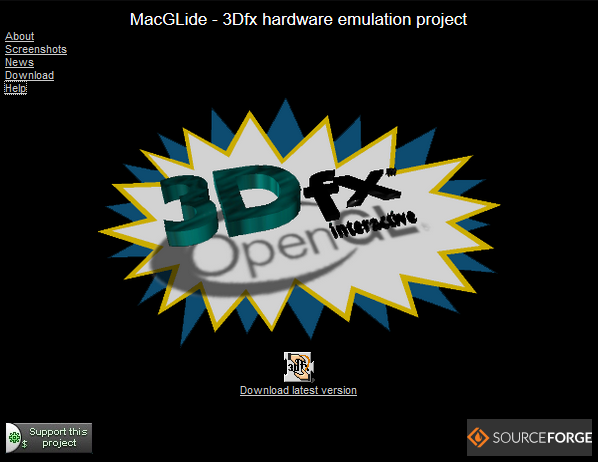

# Abstract
MacGLide is a shared library for Apple Macintosh PowerPC computers that emulates 3Dfx Voodoo Graphics hardware. It makes it possible to run games originally made for 3Dfx/Glide without the hardware by translating Glide-function calls to OpenGL.

# Last hurrah
Back in 2003 I hard-forked (read copied) MacGLide from OpenGLide to gather experience with open-source development and 3D game programming form a unique point of view. Over the years almost every 3dfx-game published for OS9 was supported.

Besides improvements in emulation there was additional support for custom resolutions, anti-aliasing, full framebuffer emulation including hand-crafted AltiVec-code for framebuffer updates and color conversion, Triangle-Edge-Adjustment for repairing gaps between adjacent object edges, and much more, all easily accessible from OSX through the MacOS classic environment.

Finally in 2008, when I was just starting to have a very good time with the project, Apple decided to give up on the PowerPC, abandoned OS9 Classic and thereby grounded the project.

All of this wouldn't have been possible without the supporters from all over the world, who were helping me to collect missing games, obtaining hardware parts, giving hints, feedback, donations,  advice on algorithms, and making suggestions for improvements.

Thank you very much!

# Remains
The original mini-web-site on SourceForge

## In-game screenshots:

Tomb Raider 1

Carmageddon

Falcon 4.0

")

Deep Space 9 - The Fallen

Myth - The Fallen Lords

FutureCop LAPD

