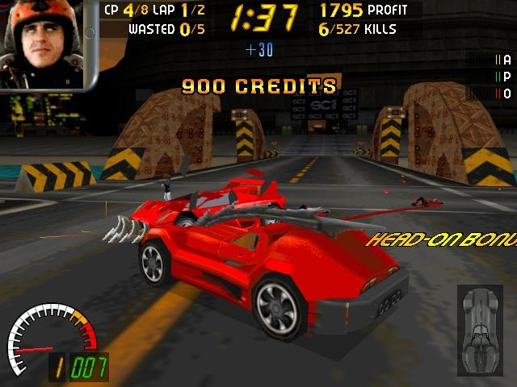
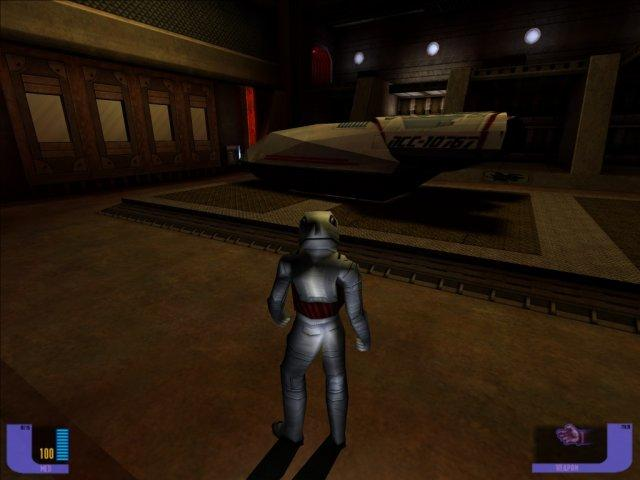
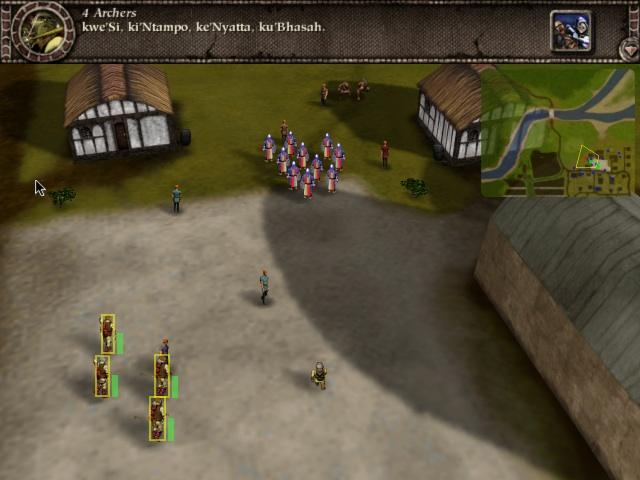
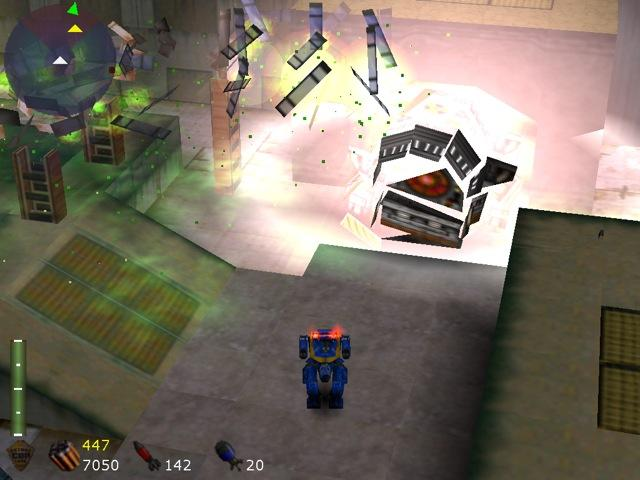

# Abstract
MacGLide is a shared library for Apple Macintosh PowerPC computers that emulates 3Dfx Voodoo Graphics hardware. It makes it possible to run games originally made for 3Dfx/Glide without the hardware by translating Glide-function calls to OpenGL.

# Last hurrah
I've hard-forked (read copied) the MacGLide project from OpenGLide back in 2003 to gather some experience with open-source development. Over the years almost every 3dfx-game published for OS9 was supported. Besides the raw emulation there was additional support for custom resolutions, anti-aliasing, full framebuffer emulation including custom Altivec-code for color conversion, scene geometry enhancing, and so on, all easily accessible from OSX through the MacOS classic environment.

Finally in 2008, when I was just starting to have a very good time with the project, Apple decided to give up on the PowerPC, abandoned OS9 Classic and thereby grounded the project.

# Remains
The original web-site can be found here: http://macglide.sourceforge.net/

In-game screeshots:

Tomb Raider 1

Carmageddon

")

Falcon 4.0

Deep Space 9 - The Fallen

Myth - The Fallen Lords

FutureCop LAPD

